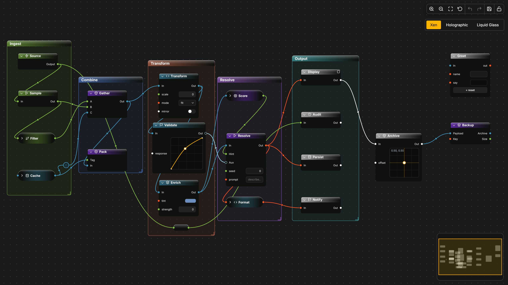
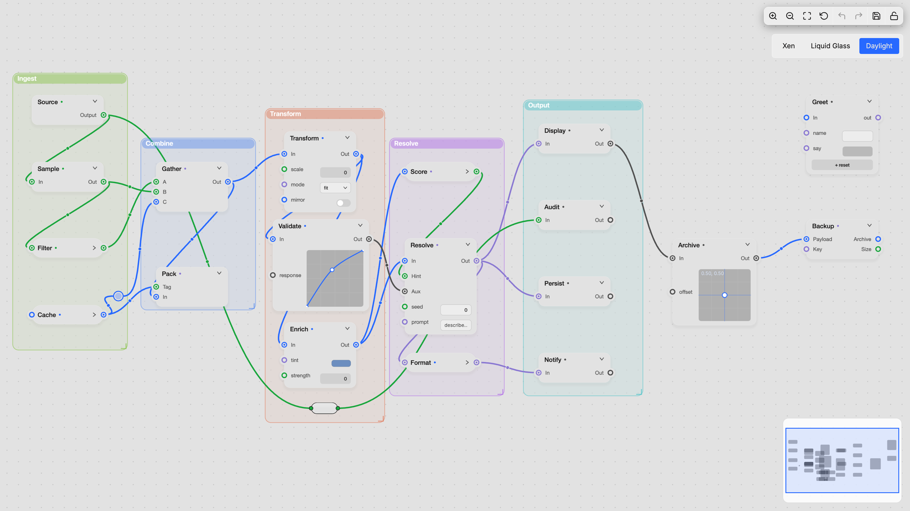
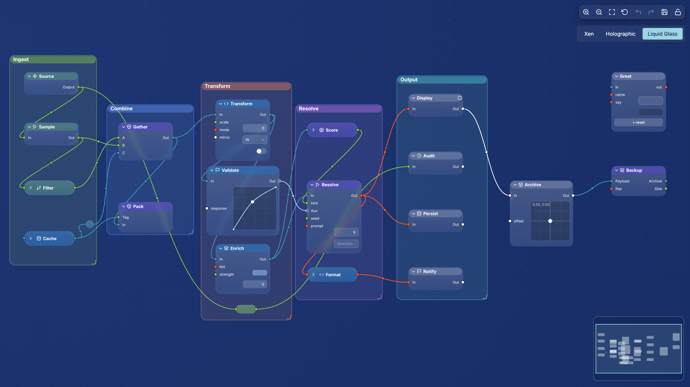

# XenolithGraph

[](https://github.com/XenolithEngine/xenolith-graph#status)
[](LICENSE)
[](https://github.com/XenolithEngine/xenolith-graph/actions)
[](#tests)
[](.size-limit.json)
[](.size-limit.json)
[](.size-limit.json)
[](.size-limit.json)
[](packages/mcp-server/TESTING.md)
[](https://github.com/XenolithEngine/xenolith-graph/discussions)

An embeddable, drop-in node-graph editor for the web with a polished design system inside the package — typed Blueprint pins, live templates, macros, in-node widgets, a plugin host — and a swappable theme architecture that replaces the renderer's material entirely, not just its palette.

> **Status: v0.7 BETA.** The public API documented in [`STABLE-API.md`](STABLE-API.md) is the surface we plan to freeze, but it is **NOT frozen yet** — breaking changes can land at any point before v1.0. If you adopt now, pin an exact version. Initial touch / mobile support landed (pinch, two-finger pan, long-press menu, drawer chrome) but a few polish items remain. See [Roadmap](#roadmap) below.

<p align="center"><a href="https://graph.xenolith.studio/playground/" target="_blank" rel="noopener noreferrer"></a> <a href="https://graph.xenolith.studio/examples/" target="_blank" rel="noopener noreferrer"></a></p>

<p align="center">
  <a href="https://graph.xenolith.studio/playground/?demo=agent" target="_blank" rel="noopener noreferrer">
    
  </a>
</p>

**Agents build. Humans debug.** The capture above is a scripted session driving the editor through the exact MCP tool surface Claude Desktop or Cursor gets — `list_node_types → add_node ×14 → connect_pins ×17 → auto_layout → set_category_palette` — then it **executes the graph for real** (step-by-step, per-node timing) and **verifies its own output** (`anomalies=2 ✓`). Every agent edit rides the same command bus as a human edit, so Ctrl+Z just works. Run it live: [playground/?demo=agent](https://graph.xenolith.studio/playground/?demo=agent).

<p align="center">
  <a href="https://graph.xenolith.studio/playground/?demo=agent&mode=propose" target="_blank" rel="noopener noreferrer">
    
  </a>
</p>

**Agents propose. Humans approve.** Connect with `mode: 'propose'` and every mutating tool call ENQUEUES instead of applying — a badge surfaces the waiting batch, the review panel lists each operation (tool, args digest, predicted effect, client identity), and **Approve all** lands the whole batch as **ONE atomic, undoable transaction**. Reject discards. Provisional node ids let the agent chain operations inside a batch; approval re-resolves everything against the current graph (ADR 0007). Run it live: [playground/?demo=agent&mode=propose](https://graph.xenolith.studio/playground/?demo=agent&mode=propose).

<p><a href="https://graph.xenolith.studio/playground/?theme=xen" target="_blank" rel="noopener noreferrer"></a> <a href="https://graph.xenolith.studio/playground/?theme=daylight" target="_blank" rel="noopener noreferrer"></a> <a href="https://graph.xenolith.studio/playground/?theme=liquid-glass" target="_blank" rel="noopener noreferrer"></a></p>

## What it does

**Vanilla / any framework:**

```ts
import { XenolithEditor } from '@xenolithengine/graph-editor'

const editor = await XenolithEditor.init('#app')
editor.loadJSON(graphDoc)
editor.fitView()
```

**React:**

```tsx
import { XenolithGraph } from '@xenolithengine/graph-react'

<XenolithGraph
  graph={graphDoc}
  fitOnLoad
  onReady={(editor) => editor.registry.register(MyNodeSchema)}
/>
```

**Vue 3:**

```vue
<script setup lang="ts">
import { XenolithGraph } from '@xenolithengine/graph-vue'
function onReady(editor) { editor.registry.register(MyNodeSchema) }
</script>
<template>
  <XenolithGraph :graph="graphDoc" fit-on-load @ready="onReady" />
</template>
```

One call (or one component) boots: fonts, PIXI v8 renderer, viewport, grid, pan/zoom, marquee, multi-drag with snap, connect-pins-by-drag, `Alt`+drag rewire, two reroute kinds, comments, collapsed macros, live templates with dive-in editing, in-node widgets, K2-style Tab palette, properties sidebar, undo/redo, JSON serialize with schema migrations, minimap, drag-and-drop palette sidebar. Headless `@xenolithengine/graph-core` is zero-dependency.

## Highlights

- **Blueprint-first.** Typed pins (`exec` vs `data`), per-type colour and shape (`circle` / `arrow` / `diamond`), registerable type **conversions** (`editor.types.registerConversion('number', 'text', String)`). Exec pins hoist onto the node header line (UE-Blueprint layout). Header glyphs from a Feather icon set or your own SVG.
- **Live templates + macros.** Reusable subgraphs with one shared definition + many instances; double-click to dive in, a breadcrumb tracks the path (`Root › Pipeline › Stage`). One-off inline grouping via macros — convert macro ↔ template either direction. `unpackTemplateInstance()` inlines a copy.
- **Comments.** Drag a coloured rectangle behind nodes; spatial group-drag moves everything inside it. Tab → "Comment" or context menu.
- **In-node widgets.** Declarative `number` / `slider` / `combo` / `text` / `toggle` / `color` / `button`, plus custom canvas-draw or DOM-mount widgets (React/Vue/Svelte via `registerWidget(name, controller)`). Conditional visibility on widget state (`displayOptions.show`), free-floating widgets (`freeFloating: true`), live values on display widgets, properties sidebar.
- **Named commands + hotkeys.** Register actions through `editor.commands` with typed `Commands.Undo`/`Commands.Redo`/… constants; cross-platform hotkey grammar (`Mod+Z` resolves to Cmd on macOS, Ctrl elsewhere). Built-in shortcuts are overridable.
- **Events + history.** Listen with `editor.on(event, fn)` — including **cancellable** variants (`edge:connecting`, `edge:disconnecting`, `node:removing`, `node:clicking` with a `cancel()` closure). Group many mutations into one undo entry via `editor.transaction(fn)` (or `beginGroup({ idleTimeoutMs })` / `endGroup()` for keystroke coalescing).
- **Save · restore · migrate · export.** Versioned `xenolith.v1` JSON (ID-sorted for clean git diffs) with per-schema `migrate(oldNode, fromVersion)` hooks — old graphs upgrade automatically. ComfyUI workflow importer. Export the **whole graph** (not the viewport) to PNG or JPEG at any resolution.
- **Auto-layout plugin.** `@xenolithengine/graph-plugin-autolayout` with Dagre and ELK adapters. One call arranges any graph; animated tweens included; bypasses the command bus per-frame and commits the final positions as one undo entry.
- **Pluggable edge paths.** Per-edge style: `bezier` (default), `smoothstep`, `step`, `linear`. Labels, arrowheads, animated marching dashes.
- **Plugin host.** `editor.use(plugin)` with a `PluginContext` that exposes schema/types/icons/widgets, an event bus, and runtime-delegation surfaces (`onTick`, `startLoop`/`stopLoop`/`step`, `setNodePins`, `setWidgetValue({ephemeral})`, `setNodePositionEphemeral`, `expandTemplateInstance`, `graphSnapshot`, `setEdgeAnimated`).
- **Three themes shipped.** Xen (dark/gold, original design system), Daylight (light-mode, protruding pin halos, Helvetica typography), and Liquid Glass (shader-based refraction + rim lighting via PIXI Mesh+Shader). Swap at runtime with `editor.setTheme(theme)`.
- **Live Mode.** `editor.setLiveMode(true)` hides editor chrome (palette, breadcrumb, controls) — perfect for read-only previews and demos.
- **Perf for real graphs.** Viewport virtualization + 3-tier LOD (full → sprite-baked → flat-batch). Render-on-demand (static graphs idle at 0 fps cost). BitmapText glyph atlas for node/widget text. Shared GPU texture caches.
- **Framework adapters.** First-class **React** (`@xenolithengine/graph-react`) and **Vue 3** (`@xenolithengine/graph-vue`) — both ship `<XenolithPanel>`/`<XenolithControls>`/`<XenolithMiniMap>`/`<XenolithButton>` with reactive selector hooks/composables, custom-widget wrappers (`reactWidget` / `vueWidget`), and full Learn pages. Thin starter packages also ship for **Svelte**, **Solid**, **Angular**, and **Web Components** (`@xenolithengine/graph-wc`) — they mount the editor and expose a typed handle. Idiomatic hooks and panel components for those four are not scheduled.
- **AI-native via MCP.** Ships its own [Model Context Protocol](https://modelcontextprotocol.io) server (`@xenolithengine/graph-mcp-server`). Start the CLI, click Connect in the editor, and Claude Desktop / Cursor can build graphs directly — `list_node_types` → `add_node` → `connect_pins` → `auto_layout`. Twenty-five tools + two resources (`graph://current`, `schema://types`). Every mutation flows through the command bus so undo and the live event stream just work. Token-auth + read-only mode supported. **Propose mode** (`connectMCP(url, { mode: 'propose' })`) is the trust boundary: agent edits queue for human approval in the built-in review panel and land as one undo step.
- **Visual stepping debugger.** `StepDebugger` is part of `@xenolithengine/graph-editor` — wrap any executor (`StepExecutor`), and you get pause/step/continue, breakpoints, per-node timing, and a live trace. The Step debugger / Time-travel scrubber / Per-node cost heatmap / Graph diff for PR-review showcases all ride this primitive — drop-in observability for any graph runtime.

## Bundle size

Honest numbers, measured by [size-limit](https://github.com/ai/size-limit) on the latest build. Tree-shaken, minified, gzipped. Run `pnpm size` to reproduce.

| Package | Gzip | Notes |
|---|---|---|
| `@xenolithengine/graph-core` | **8.4 KB** | Headless graph model — zero deps |
| `@xenolithengine/graph-render-pixi` | **17.4 KB** | (excl. PIXI peer dep) |
| `@xenolithengine/graph-editor` | **74.3 KB** | Everything: core + renderer + interaction + macros/templates + step debugger + MCP client (excl. PIXI) |
| `@xenolithengine/graph-react` | **2.3 KB** | Adapter on top of `@xenolithengine/graph-editor` |
| `@xenolithengine/graph-theme-xen` | **2.3 KB** | Default theme tokens + bundled Inter |
| `@xenolithengine/graph-theme-daylight` | **5.0 KB** | Light-mode theme, custom pin-halo renderer |
| `@xenolithengine/graph-theme-liquid-glass` | **7.9 KB** | Shader-based frosted-glass theme |
| `@xenolithengine/graph-plugin-autolayout` (dagre adapter) | **0.8 KB** | (excl. `dagre` peer dep — ~30 KB if you opt in) |
| **`pixi.js` (peer dep)** | **~250 KB** | The WebGL renderer we ship on top of |
| **Realistic React app load** | **~330 KB** | Our code + PIXI |

### How we compare

Tested against the published bundles of competitors (2025 data via [bundlephobia](https://bundlephobia.com)):

| Library | App + peer gzip | Renderer |
|---|---|---|
| Drawflow | 25 KB | DOM |
| LiteGraph.js | 50 KB | Canvas2D |
| Rete.js (+ react plugin) | 55 KB | DOM |
| Baklava (Vue) | ~95 KB | DOM |
| **React Flow / @xyflow/react** | **130 KB** | SVG |
| **XenolithGraph (with PIXI)** | **~330 KB** | **WebGL via PIXI** |

We are the heaviest. PIXI accounts for ~75% of the weight — and it's also what makes the WebGL renderer + viewport virtualization possible. Without PIXI we ship ~80 KB, in line with the alternatives.

**Pick something lighter** if mobile-first SaaS where every kB matters (Drawflow / Rete), or Vue-only projects where the editor is one feature (Baklava). **Pick us** when the editor IS the product (AI workflow builders, ComfyUI-class tools, visual debuggers) and you'd rather ship 330 KB once than refactor renderers later.

## Theming

A `XenolithTheme` bundles design tokens, an optional custom `renderNode`, and an optional `createGrid` for the canvas backdrop. Themes swap at runtime through `editor.setTheme(theme)` and re-render every node in place; selection, hover, collapse state, positions are preserved.

```ts
import { xenTheme } from '@xenolithengine/graph-render-pixi'
import { liquidGlassTheme } from '@xenolithengine/graph-theme-liquid-glass'

editor.setTheme(liquidGlassTheme)   // instant — every node re-rendered, state preserved
editor.setTheme(xenTheme)
```

The shader-heavy backdrop pass is **opt-in per theme** (`theme.needsBackdrop`) — Xen pays zero extra render cost; Liquid Glass turns it on automatically.

## Roadmap

### ✅ Shipped in v0.7 BETA

- **Core** — `@xenolithengine/graph-core` headless model, command bus, typed pins, type registry with conversions, `evaluateGraph` for a host data pass
- **Renderer** — `@xenolithengine/graph-render-pixi` WebGL editor, viewport virtualization + LOD past 300 nodes
- **Editor** — `@xenolithengine/graph-editor` namespaces (`view` / `history` / `chrome` / `clipboard`), 25 typed events (7 preventable), context-menu plugin API
- **Adapters** — React (`@xenolithengine/graph-react`) and Vue 3 (`@xenolithengine/graph-vue`) with full hook / composable parity, panel components, and `reactWidget` / `vueWidget` wrappers. Thin starter adapters for Svelte, Solid, Angular, and Web Components (`@xenolithengine/graph-wc`). Idiomatic hooks for those four are not scheduled
- **Themes** — Xen (default, original design system) + Daylight (light-mode) + Liquid Glass (refraction-based glass), runtime `setTheme()` swap
- **In-node widgets** — number / slider / combo / text / toggle / color / button + custom canvas + custom DOM (`reactWidget` / `vueWidget` ports)
- **Header icons** — 13 built-in Feather glyphs, `editor.icons.register(name, svgInner)` for custom
- **Macros & templates** — group selection inline, extract as reusable template, dive-in with breadcrumb, convert either direction
- **Save / export** — versioned `xenolith.v1` JSON with `migrate` hooks, ComfyUI workflow importer, full-graph PNG / JPEG export
- **Palette** — Tab fuzzy search, palette sidebar (drag-and-drop spawn), edge-midpoint insert
- **Initial touch / mobile** — pinch zoom, two-finger pan, long-press context menu, drawer chrome on narrow viewports, ⛶ pseudo-fullscreen
- **AI / MCP** — `@xenolithengine/graph-mcp-server` (26 tools + 3 resources) + WebSocket bridge, `/llms.txt` + `/api/openapi.json` for AI agents
- **Auto-layout** — Dagre + ELK adapters, one-call animated re-layout
- **Step debugger** — `StepDebugger` core primitive (powers debugger / time-travel / heatmap / graph-diff showcases)

### 🚧 Before v1.0

v1.0 is a freeze of the API in [`STABLE-API.md`](STABLE-API.md) and of the `xenolith.v1` file format. It is not frozen yet.

Still open, and only if a real host needs them:

- Canvas accessibility: ARIA and keyboard navigation of nodes. The canvas itself is not exposed to a screen reader.
- Touch polish past the gestures already shipped: virtual keyboard, marquee with a finger, drawer behaviour.

### Not scheduled

These were listed here before. They are not the plan until someone is actually blocked by them:

- Several graphs in one WebGL context
- Collaboration
- Right-to-left layout
- A custom renderer instead of PIXI
- Obstacle-avoiding orthogonal wires
- Moving layout or topology into WASM

`@xenolithengine/graph-plugin-runtime` is an experimental Blueprint VM. Host dataflow uses `evaluateGraph` from `@xenolithengine/graph-core` — see the guide [Run your own nodes](https://graph.xenolith.studio/guides/run/). A Mandelbrot microbenchmark in `runtime-as` is not a claim about workflow speed.

## Packages

| Package | Role |
|---|---|
| `@xenolithengine/graph-core` | Headless graph model, types, command bus, events, plan-* helpers for macros/templates/reroutes. Zero deps. |
| `@xenolithengine/graph-render-pixi` | PIXI v8 renderer (nodes, edges, comments, macros, widgets, glyphs, LOD). PIXI is a peer dependency. |
| `@xenolithengine/graph-editor` | Composes renderer + interaction + commands + plugin host. The public entry point. |
| `@xenolithengine/graph-theme-xen` | Default Xen design tokens, bundled Inter fonts. |
| `@xenolithengine/graph-theme-daylight` | Daylight theme — light-mode canvas, protruding pin halos, Helvetica typography. |
| `@xenolithengine/graph-theme-liquid-glass` | Liquid Glass theme — radial backdrop + GLSL Mesh material. |
| `@xenolithengine/demo` | One `xenolith.v1` data graph + ComfyUI importer + topology-reactive runners. Consumed by every demo host. |
| `@xenolithengine/graph-adapter-core`, `@xenolithengine/graph-wc` | Framework-agnostic editor wrapper + universal web component. |
| `@xenolithengine/graph-react` | React adapter (`<XenolithPanel>` / `<XenolithControls>` / `<XenolithMiniMap>` / `<XenolithButton>`, reactive selector hooks). |
| `@xenolithengine/graph-test-utils` | jsdom test kit for hosts — `mockPixi()` / `renderEditorToDOM()` boot the real WebGL editor headlessly; `/react` and `/fake` subpaths for adapter tests and logic-level tests. |
| `@xenolithengine/graph-mcp-server` | MCP server (stdio MCP ↔ WS bridge → browser editor via `editor.connectMCP(url)`). 26 tools + 3 resources, token-auth, read-only mode. |
| `@xenolithengine/graph-plugin-runtime` *(in progress)* | Blueprint VM (exec-push + pure-pull, `Allocate` verb). Installs via `editor.use()`. |

## Develop

```sh
pnpm install
pnpm --filter @xenolithengine/playground dev      # localhost:5173, includes a theme switcher
pnpm --filter @xenolithengine/site dev            # the docs + landing site (Astro Starlight)
pnpm test                                    # vitest across all packages
pnpm -w test:e2e                             # playwright (chromium + firefox)
pnpm build                                   # tsc -b across all packages
```

Architecture: [`docs/ARCHITECTURE.md`](docs/ARCHITECTURE.md). ADRs: [`docs/adr/`](docs/adr/). Public API guide: [docs site](apps/site).

## Tests

`pnpm test` runs the full suite.

- **1356 unit tests** across `@xenolithengine/graph-*` packages (Vitest)
- **117 interaction tests** across `apps/playground/tests` (Playwright — chromium + firefox)
- Visual snapshot tests for the renderer (PIXI render → PNG → image-diff)
- `pnpm size` enforces per-package bundle budgets in CI

Hosts unit-test their own integration with [`@xenolithengine/graph-test-utils`](https://graph.xenolith.studio/guides/testing/) — it boots the real WebGL editor under vitest + jsdom.

Coverage report and visual baselines live in `coverage/` and `apps/playground/tests/__snapshots__/`.

## Star history

[](https://star-history.com/#XenolithEngine/xenolith-graph&Date)

## History

XenolithGraph is the spiritual successor to [BluePrintRenderer](https://github.com/strelok2012/BluePrintRenderer) (2019, 109★, now archived) — a complete rewrite in TypeScript + WebGL (PIXI v8) with modern bundler support, framework adapters (React / Vue / Svelte / Solid / Angular / Web Components), an opinionated visual design system (Xen), and AI-agent integration via MCP. If you used the old project — same author, much sharper tooling.

## License

MIT.
